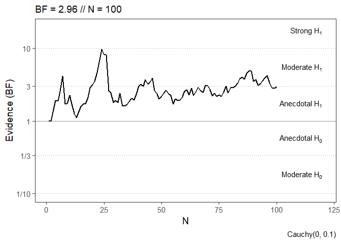
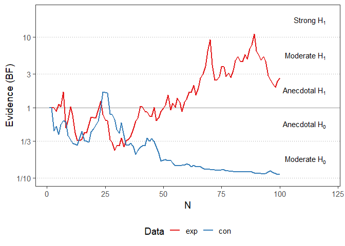
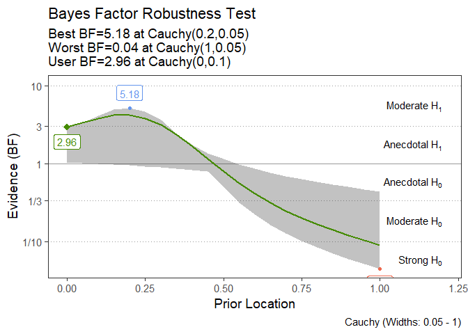
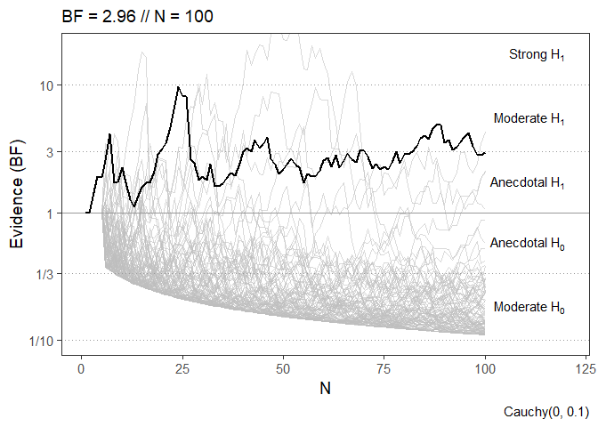
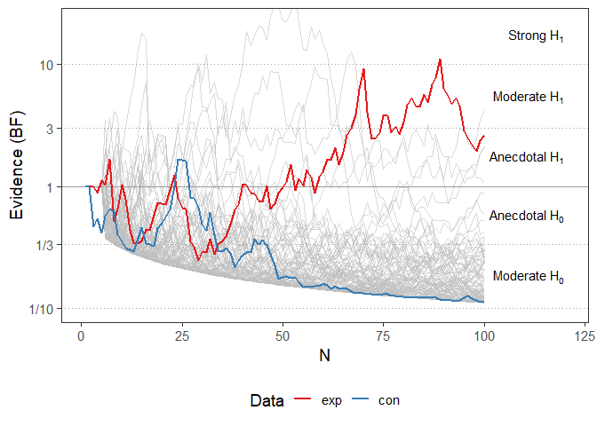
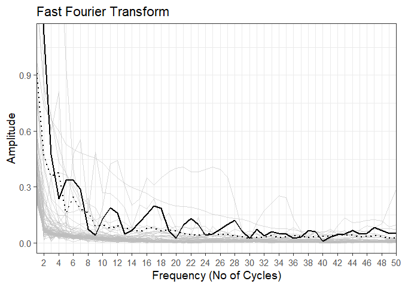
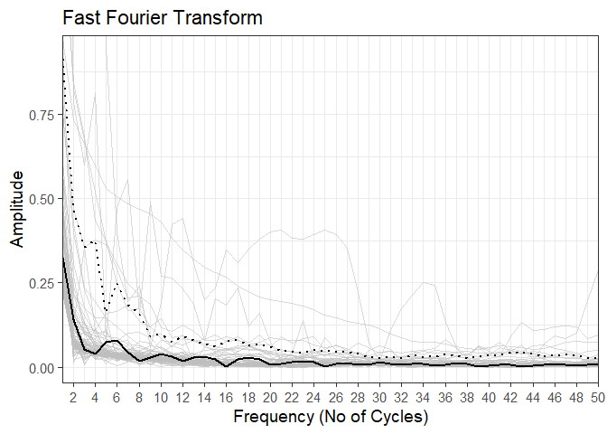

### Generate Sample Data


```r
set.seed(9878)

exp=rbinom(100,20,0.52)
con=rbinom(100,20,0.5)

summary(exp)
```

```
##    Min. 1st Qu.  Median    Mean 3rd Qu.    Max. 
##    6.00    9.00   11.00   10.54   12.00   15.00
```

```r
summary(con)
```

```
##    Min. 1st Qu.  Median    Mean 3rd Qu.    Max. 
##    5.00    8.75   10.00    9.96   12.00   15.00
```

```r
df <- data.frame(condition = c(rep("exp", 100), rep("con", 100)),
                      value = c(exp, con))
```

### Load library


```r
library(changeofevidence)
```

## Bayes Factor testing
### Calculate Sequential Bayes Factors


```r
# Undirectional one-sample t-tests with broad prior
bf.exp <- bfttest(exp, mu = 10, alternative = "two.sided", prior.loc = 0, prior.r = 0.707)
```

```
## One Sample test (N = 100)
## Calculating Sequential Bayes Factors...
## 
  |                                                                            
  |                                                                      |   0%
  |                                                                            
  |=                                                                     |   1%
  |                                                                            
  |=                                                                     |   2%
  |                                                                            
  |==                                                                    |   3%
  |                                                                            
  |===                                                                   |   4%
  |                                                                            
  |====                                                                  |   5%
  |                                                                            
  |====                                                                  |   6%
  |                                                                            
  |=====                                                                 |   7%
  |                                                                            
  |======                                                                |   8%
  |                                                                            
  |======                                                                |   9%
  |                                                                            
  |=======                                                               |  10%
  |                                                                            
  |========                                                              |  11%
  |                                                                            
  |=========                                                             |  12%
  |                                                                            
  |=========                                                             |  13%
  |                                                                            
  |==========                                                            |  14%
  |                                                                            
  |===========                                                           |  15%
  |                                                                            
  |===========                                                           |  16%
  |                                                                            
  |============                                                          |  17%
  |                                                                            
  |=============                                                         |  18%
  |                                                                            
  |==============                                                        |  19%
  |                                                                            
  |==============                                                        |  20%
  |                                                                            
  |===============                                                       |  21%
  |                                                                            
  |================                                                      |  22%
  |                                                                            
  |================                                                      |  23%
  |                                                                            
  |=================                                                     |  24%
  |                                                                            
  |==================                                                    |  26%
  |                                                                            
  |===================                                                   |  27%
  |                                                                            
  |===================                                                   |  28%
  |                                                                            
  |====================                                                  |  29%
  |                                                                            
  |=====================                                                 |  30%
  |                                                                            
  |=====================                                                 |  31%
  |                                                                            
  |======================                                                |  32%
  |                                                                            
  |=======================                                               |  33%
  |                                                                            
  |========================                                              |  34%
  |                                                                            
  |========================                                              |  35%
  |                                                                            
  |=========================                                             |  36%
  |                                                                            
  |==========================                                            |  37%
  |                                                                            
  |==========================                                            |  38%
  |                                                                            
  |===========================                                           |  39%
  |                                                                            
  |============================                                          |  40%
  |                                                                            
  |=============================                                         |  41%
  |                                                                            
  |=============================                                         |  42%
  |                                                                            
  |==============================                                        |  43%
  |                                                                            
  |===============================                                       |  44%
  |                                                                            
  |===============================                                       |  45%
  |                                                                            
  |================================                                      |  46%
  |                                                                            
  |=================================                                     |  47%
  |                                                                            
  |==================================                                    |  48%
  |                                                                            
  |==================================                                    |  49%
  |                                                                            
  |===================================                                   |  50%
  |                                                                            
  |====================================                                  |  51%
  |                                                                            
  |====================================                                  |  52%
  |                                                                            
  |=====================================                                 |  53%
  |                                                                            
  |======================================                                |  54%
  |                                                                            
  |=======================================                               |  55%
  |                                                                            
  |=======================================                               |  56%
  |                                                                            
  |========================================                              |  57%
  |                                                                            
  |=========================================                             |  58%
  |                                                                            
  |=========================================                             |  59%
  |                                                                            
  |==========================================                            |  60%
  |                                                                            
  |===========================================                           |  61%
  |                                                                            
  |============================================                          |  62%
  |                                                                            
  |============================================                          |  63%
  |                                                                            
  |=============================================                         |  64%
  |                                                                            
  |==============================================                        |  65%
  |                                                                            
  |==============================================                        |  66%
  |                                                                            
  |===============================================                       |  67%
  |                                                                            
  |================================================                      |  68%
  |                                                                            
  |=================================================                     |  69%
  |                                                                            
  |=================================================                     |  70%
  |                                                                            
  |==================================================                    |  71%
  |                                                                            
  |===================================================                   |  72%
  |                                                                            
  |===================================================                   |  73%
  |                                                                            
  |====================================================                  |  74%
  |                                                                            
  |=====================================================                 |  76%
  |                                                                            
  |======================================================                |  77%
  |                                                                            
  |======================================================                |  78%
  |                                                                            
  |=======================================================               |  79%
  |                                                                            
  |========================================================              |  80%
  |                                                                            
  |========================================================              |  81%
  |                                                                            
  |=========================================================             |  82%
  |                                                                            
  |==========================================================            |  83%
  |                                                                            
  |===========================================================           |  84%
  |                                                                            
  |===========================================================           |  85%
  |                                                                            
  |============================================================          |  86%
  |                                                                            
  |=============================================================         |  87%
  |                                                                            
  |=============================================================         |  88%
  |                                                                            
  |==============================================================        |  89%
  |                                                                            
  |===============================================================       |  90%
  |                                                                            
  |================================================================      |  91%
  |                                                                            
  |================================================================      |  92%
  |                                                                            
  |=================================================================     |  93%
  |                                                                            
  |==================================================================    |  94%
  |                                                                            
  |==================================================================    |  95%
  |                                                                            
  |===================================================================   |  96%
  |                                                                            
  |====================================================================  |  97%
  |                                                                            
  |===================================================================== |  98%
  |                                                                            
  |===================================================================== |  99%
  |                                                                            
  |======================================================================| 100%
## Final Bayes Factor: 2.640455 (t=2.59456; p=0.01090879)
```

```r
print(bf.exp)
```

```
## 
##   Sequential Bayesian Testing
##   --------------------------------	
##   Test type: one-sample
##   Sample size: 100
##   Final Bayes Factor: BF10=2.64; BF01=0.379
##   Parameter prior: Cauchy(0, 0.707)
##   Directionality of H1 analysis prior: two.sided
##   Orthodox Test: t-value=2.595; p=0.011
## 
```

```r
# Use exact=FALSE for a quicker test that doers not calculate every single BF
bf.con <- bfttest(con, mu = 10, alternative = "two.sided", prior.loc = 0, prior.r = 0.707, exact=FALSE)
```

```
## One Sample test (N = 100)
## Calculating Sequential Bayes Factors...
## 
  |                                                                            
  |                                                                      |   0%
  |                                                                            
  |=                                                                     |   1%
  |                                                                            
  |=                                                                     |   2%
  |                                                                            
  |==                                                                    |   3%
  |                                                                            
  |===                                                                   |   4%
  |                                                                            
  |====                                                                  |   5%
  |                                                                            
  |====                                                                  |   6%
  |                                                                            
  |=====                                                                 |   7%
  |                                                                            
  |======                                                                |   8%
  |                                                                            
  |======                                                                |   9%
  |                                                                            
  |=======                                                               |  10%
  |                                                                            
  |========                                                              |  11%
  |                                                                            
  |=========                                                             |  12%
  |                                                                            
  |=========                                                             |  13%
  |                                                                            
  |==========                                                            |  14%
  |                                                                            
  |===========                                                           |  15%
  |                                                                            
  |===========                                                           |  16%
  |                                                                            
  |============                                                          |  17%
  |                                                                            
  |=============                                                         |  18%
  |                                                                            
  |==============                                                        |  19%
  |                                                                            
  |==============                                                        |  20%
  |                                                                            
  |===============                                                       |  21%
  |                                                                            
  |================                                                      |  22%
  |                                                                            
  |================                                                      |  23%
  |                                                                            
  |=================                                                     |  24%
  |                                                                            
  |==================                                                    |  26%
  |                                                                            
  |===================                                                   |  27%
  |                                                                            
  |===================                                                   |  28%
  |                                                                            
  |====================                                                  |  29%
  |                                                                            
  |=====================                                                 |  30%
  |                                                                            
  |=====================                                                 |  31%
  |                                                                            
  |======================                                                |  32%
  |                                                                            
  |=======================                                               |  33%
  |                                                                            
  |========================                                              |  34%
  |                                                                            
  |========================                                              |  35%
  |                                                                            
  |=========================                                             |  36%
  |                                                                            
  |==========================                                            |  37%
  |                                                                            
  |==========================                                            |  38%
  |                                                                            
  |===========================                                           |  39%
  |                                                                            
  |============================                                          |  40%
  |                                                                            
  |=============================                                         |  41%
  |                                                                            
  |=============================                                         |  42%
  |                                                                            
  |==============================                                        |  43%
  |                                                                            
  |===============================                                       |  44%
  |                                                                            
  |===============================                                       |  45%
  |                                                                            
  |================================                                      |  46%
  |                                                                            
  |=================================                                     |  47%
  |                                                                            
  |==================================                                    |  48%
  |                                                                            
  |==================================                                    |  49%
  |                                                                            
  |===================================                                   |  50%
  |                                                                            
  |====================================                                  |  51%
  |                                                                            
  |====================================                                  |  52%
  |                                                                            
  |=====================================                                 |  53%
  |                                                                            
  |======================================                                |  54%
  |                                                                            
  |=======================================                               |  55%
  |                                                                            
  |=======================================                               |  56%
  |                                                                            
  |========================================                              |  57%
  |                                                                            
  |=========================================                             |  58%
  |                                                                            
  |=========================================                             |  59%
  |                                                                            
  |==========================================                            |  60%
  |                                                                            
  |===========================================                           |  61%
  |                                                                            
  |============================================                          |  62%
  |                                                                            
  |============================================                          |  63%
  |                                                                            
  |=============================================                         |  64%
  |                                                                            
  |==============================================                        |  65%
  |                                                                            
  |==============================================                        |  66%
  |                                                                            
  |===============================================                       |  67%
  |                                                                            
  |================================================                      |  68%
  |                                                                            
  |=================================================                     |  69%
  |                                                                            
  |=================================================                     |  70%
  |                                                                            
  |==================================================                    |  71%
  |                                                                            
  |===================================================                   |  72%
  |                                                                            
  |===================================================                   |  73%
  |                                                                            
  |====================================================                  |  74%
  |                                                                            
  |=====================================================                 |  76%
  |                                                                            
  |======================================================                |  77%
  |                                                                            
  |======================================================                |  78%
  |                                                                            
  |=======================================================               |  79%
  |                                                                            
  |========================================================              |  80%
  |                                                                            
  |========================================================              |  81%
  |                                                                            
  |=========================================================             |  82%
  |                                                                            
  |==========================================================            |  83%
  |                                                                            
  |===========================================================           |  84%
  |                                                                            
  |===========================================================           |  85%
  |                                                                            
  |============================================================          |  86%
  |                                                                            
  |=============================================================         |  87%
  |                                                                            
  |=============================================================         |  88%
  |                                                                            
  |==============================================================        |  89%
  |                                                                            
  |===============================================================       |  90%
  |                                                                            
  |================================================================      |  91%
  |                                                                            
  |================================================================      |  92%
  |                                                                            
  |=================================================================     |  93%
  |                                                                            
  |==================================================================    |  94%
  |                                                                            
  |==================================================================    |  95%
  |                                                                            
  |===================================================================   |  96%
  |                                                                            
  |====================================================================  |  97%
  |                                                                            
  |===================================================================== |  98%
  |                                                                            
  |===================================================================== |  99%
  |                                                                            
  |======================================================================| 100%
## Final Bayes Factor: 0.1123492 (t=-0.1732313; p=0.8628233)
```

```r
print(bf.con)
```

```
## 
##   Sequential Bayesian Testing
##   --------------------------------	
##   Test type: one-sample
##   Sample size: 100
##   Final Bayes Factor: BF10=0.112; BF01=8.901
##   Parameter prior: Cauchy(0, 0.707)
##   Directionality of H1 analysis prior: two.sided
##   Orthodox Test: t-value=-0.173; p=0.863
## 
```

```r
# only the last 5 data points
bfttest(con, mu = 10, alternative = "two.sided", prior.loc = 0, prior.r = 0.707, nstart = length(con)-5)
```

```
## One Sample test (N = 100)
## Calculating Sequential Bayes Factors...
## 
  |                                                                            
  |                                                                      |   0%
  |                                                                            
  |==============                                                        |  20%
  |                                                                            
  |============================                                          |  40%
  |                                                                            
  |==========================================                            |  60%
  |                                                                            
  |========================================================              |  80%
  |                                                                            
  |======================================================================| 100%
## Final Bayes Factor: 0.1123492 (t=-0.1732313; p=0.8628233)
```

```
## 
##   Sequential Bayesian Testing
##   --------------------------------	
##   Test type: one-sample
##   Sample size: 100
##   Final Bayes Factor: BF10=0.112; BF01=8.901
##   Parameter prior: Cauchy(0, 0.707)
##   Directionality of H1 analysis prior: two.sided
##   Orthodox Test: t-value=-0.173; p=0.863
## 
```

```r
# Directional paired samples t-test with narrow prior
bf.paired <- bfttest(exp, con, alternative = "greater", prior.loc = 0, prior.r = 0.1)
```

```
## Paired Samples test (N = 100)
## Calculating Sequential Bayes Factors...
## 
  |                                                                            
  |                                                                      |   0%
  |                                                                            
  |=                                                                     |   1%
  |                                                                            
  |=                                                                     |   2%
  |                                                                            
  |==                                                                    |   3%
  |                                                                            
  |===                                                                   |   4%
  |                                                                            
  |====                                                                  |   5%
  |                                                                            
  |====                                                                  |   6%
  |                                                                            
  |=====                                                                 |   7%
  |                                                                            
  |======                                                                |   8%
  |                                                                            
  |======                                                                |   9%
  |                                                                            
  |=======                                                               |  10%
  |                                                                            
  |========                                                              |  11%
  |                                                                            
  |=========                                                             |  12%
  |                                                                            
  |=========                                                             |  13%
  |                                                                            
  |==========                                                            |  14%
  |                                                                            
  |===========                                                           |  15%
  |                                                                            
  |===========                                                           |  16%
  |                                                                            
  |============                                                          |  17%
  |                                                                            
  |=============                                                         |  18%
  |                                                                            
  |==============                                                        |  19%
  |                                                                            
  |==============                                                        |  20%
  |                                                                            
  |===============                                                       |  21%
  |                                                                            
  |================                                                      |  22%
  |                                                                            
  |================                                                      |  23%
  |                                                                            
  |=================                                                     |  24%
  |                                                                            
  |==================                                                    |  26%
  |                                                                            
  |===================                                                   |  27%
  |                                                                            
  |===================                                                   |  28%
  |                                                                            
  |====================                                                  |  29%
  |                                                                            
  |=====================                                                 |  30%
  |                                                                            
  |=====================                                                 |  31%
  |                                                                            
  |======================                                                |  32%
  |                                                                            
  |=======================                                               |  33%
  |                                                                            
  |========================                                              |  34%
  |                                                                            
  |========================                                              |  35%
  |                                                                            
  |=========================                                             |  36%
  |                                                                            
  |==========================                                            |  37%
  |                                                                            
  |==========================                                            |  38%
  |                                                                            
  |===========================                                           |  39%
  |                                                                            
  |============================                                          |  40%
  |                                                                            
  |=============================                                         |  41%
  |                                                                            
  |=============================                                         |  42%
  |                                                                            
  |==============================                                        |  43%
  |                                                                            
  |===============================                                       |  44%
  |                                                                            
  |===============================                                       |  45%
  |                                                                            
  |================================                                      |  46%
  |                                                                            
  |=================================                                     |  47%
  |                                                                            
  |==================================                                    |  48%
  |                                                                            
  |==================================                                    |  49%
  |                                                                            
  |===================================                                   |  50%
  |                                                                            
  |====================================                                  |  51%
  |                                                                            
  |====================================                                  |  52%
  |                                                                            
  |=====================================                                 |  53%
  |                                                                            
  |======================================                                |  54%
  |                                                                            
  |=======================================                               |  55%
  |                                                                            
  |=======================================                               |  56%
  |                                                                            
  |========================================                              |  57%
  |                                                                            
  |=========================================                             |  58%
  |                                                                            
  |=========================================                             |  59%
  |                                                                            
  |==========================================                            |  60%
  |                                                                            
  |===========================================                           |  61%
  |                                                                            
  |============================================                          |  62%
  |                                                                            
  |============================================                          |  63%
  |                                                                            
  |=============================================                         |  64%
  |                                                                            
  |==============================================                        |  65%
  |                                                                            
  |==============================================                        |  66%
  |                                                                            
  |===============================================                       |  67%
  |                                                                            
  |================================================                      |  68%
  |                                                                            
  |=================================================                     |  69%
  |                                                                            
  |=================================================                     |  70%
  |                                                                            
  |==================================================                    |  71%
  |                                                                            
  |===================================================                   |  72%
  |                                                                            
  |===================================================                   |  73%
  |                                                                            
  |====================================================                  |  74%
  |                                                                            
  |=====================================================                 |  76%
  |                                                                            
  |======================================================                |  77%
  |                                                                            
  |======================================================                |  78%
  |                                                                            
  |=======================================================               |  79%
  |                                                                            
  |========================================================              |  80%
  |                                                                            
  |========================================================              |  81%
  |                                                                            
  |=========================================================             |  82%
  |                                                                            
  |==========================================================            |  83%
  |                                                                            
  |===========================================================           |  84%
  |                                                                            
  |===========================================================           |  85%
  |                                                                            
  |============================================================          |  86%
  |                                                                            
  |=============================================================         |  87%
  |                                                                            
  |=============================================================         |  88%
  |                                                                            
  |==============================================================        |  89%
  |                                                                            
  |===============================================================       |  90%
  |                                                                            
  |================================================================      |  91%
  |                                                                            
  |================================================================      |  92%
  |                                                                            
  |=================================================================     |  93%
  |                                                                            
  |==================================================================    |  94%
  |                                                                            
  |==================================================================    |  95%
  |                                                                            
  |===================================================================   |  96%
  |                                                                            
  |====================================================================  |  97%
  |                                                                            
  |===================================================================== |  98%
  |                                                                            
  |===================================================================== |  99%
  |                                                                            
  |======================================================================| 100%
## Final Bayes Factor: 2.960334 (t=1.974355; p=0.02556375)
```

```r
print(bf.paired)
```

```
## 
##   Sequential Bayesian Testing
##   --------------------------------	
##   Test type: paired
##   Sample size: 100
##   Final Bayes Factor: BF10=2.96; BF01=0.338
##   Parameter prior: Cauchy(0, 0.1)
##   Directionality of H1 analysis prior: greater
##   Orthodox Test: t-value=1.974; p=0.026
## 
```

```r
# Independent samples t-test with informed prior
bf.between <- bfttest(value ~ condition, data = df, alternative = "less", prior.loc = 0.1, prior.r = 0.1)
```

```
## Independent Samples test (N = 200 [100 + 100])
## Calculating Sequential Bayes Factors...
## First observation with two groups found at N = 101
  |                                                                            
  |                                                                      |   0%
  |                                                                            
  |=                                                                     |   1%
  |                                                                            
  |=                                                                     |   2%
  |                                                                            
  |==                                                                    |   3%
  |                                                                            
  |===                                                                   |   4%
  |                                                                            
  |====                                                                  |   5%
  |                                                                            
  |====                                                                  |   6%
  |                                                                            
  |=====                                                                 |   7%
  |                                                                            
  |======                                                                |   8%
  |                                                                            
  |======                                                                |   9%
  |                                                                            
  |=======                                                               |  10%
  |                                                                            
  |========                                                              |  11%
  |                                                                            
  |========                                                              |  12%
  |                                                                            
  |=========                                                             |  13%
  |                                                                            
  |==========                                                            |  14%
  |                                                                            
  |===========                                                           |  15%
  |                                                                            
  |===========                                                           |  16%
  |                                                                            
  |============                                                          |  17%
  |                                                                            
  |=============                                                         |  18%
  |                                                                            
  |=============                                                         |  19%
  |                                                                            
  |==============                                                        |  20%
  |                                                                            
  |===============                                                       |  21%
  |                                                                            
  |================                                                      |  22%
  |                                                                            
  |================                                                      |  23%
  |                                                                            
  |=================                                                     |  24%
  |                                                                            
  |==================                                                    |  25%
  |                                                                            
  |==================                                                    |  26%
  |                                                                            
  |===================                                                   |  27%
  |                                                                            
  |====================                                                  |  28%
  |                                                                            
  |=====================                                                 |  29%
  |                                                                            
  |=====================                                                 |  30%
  |                                                                            
  |======================                                                |  31%
  |                                                                            
  |=======================                                               |  32%
  |                                                                            
  |=======================                                               |  33%
  |                                                                            
  |========================                                              |  34%
  |                                                                            
  |=========================                                             |  35%
  |                                                                            
  |=========================                                             |  36%
  |                                                                            
  |==========================                                            |  37%
  |                                                                            
  |===========================                                           |  38%
  |                                                                            
  |============================                                          |  39%
  |                                                                            
  |============================                                          |  40%
  |                                                                            
  |=============================                                         |  41%
  |                                                                            
  |==============================                                        |  42%
  |                                                                            
  |==============================                                        |  43%
  |                                                                            
  |===============================                                       |  44%
  |                                                                            
  |================================                                      |  45%
  |                                                                            
  |=================================                                     |  46%
  |                                                                            
  |=================================                                     |  47%
  |                                                                            
  |==================================                                    |  48%
  |                                                                            
  |===================================                                   |  49%
  |                                                                            
  |===================================                                   |  51%
  |                                                                            
  |====================================                                  |  52%
  |                                                                            
  |=====================================                                 |  53%
  |                                                                            
  |=====================================                                 |  54%
  |                                                                            
  |======================================                                |  55%
  |                                                                            
  |=======================================                               |  56%
  |                                                                            
  |========================================                              |  57%
  |                                                                            
  |========================================                              |  58%
  |                                                                            
  |=========================================                             |  59%
  |                                                                            
  |==========================================                            |  60%
  |                                                                            
  |==========================================                            |  61%
  |                                                                            
  |===========================================                           |  62%
  |                                                                            
  |============================================                          |  63%
  |                                                                            
  |=============================================                         |  64%
  |                                                                            
  |=============================================                         |  65%
  |                                                                            
  |==============================================                        |  66%
  |                                                                            
  |===============================================                       |  67%
  |                                                                            
  |===============================================                       |  68%
  |                                                                            
  |================================================                      |  69%
  |                                                                            
  |=================================================                     |  70%
  |                                                                            
  |=================================================                     |  71%
  |                                                                            
  |==================================================                    |  72%
  |                                                                            
  |===================================================                   |  73%
  |                                                                            
  |====================================================                  |  74%
  |                                                                            
  |====================================================                  |  75%
  |                                                                            
  |=====================================================                 |  76%
  |                                                                            
  |======================================================                |  77%
  |                                                                            
  |======================================================                |  78%
  |                                                                            
  |=======================================================               |  79%
  |                                                                            
  |========================================================              |  80%
  |                                                                            
  |=========================================================             |  81%
  |                                                                            
  |=========================================================             |  82%
  |                                                                            
  |==========================================================            |  83%
  |                                                                            
  |===========================================================           |  84%
  |                                                                            
  |===========================================================           |  85%
  |                                                                            
  |============================================================          |  86%
  |                                                                            
  |=============================================================         |  87%
  |                                                                            
  |==============================================================        |  88%
  |                                                                            
  |==============================================================        |  89%
  |                                                                            
  |===============================================================       |  90%
  |                                                                            
  |================================================================      |  91%
  |                                                                            
  |================================================================      |  92%
  |                                                                            
  |=================================================================     |  93%
  |                                                                            
  |==================================================================    |  94%
  |                                                                            
  |==================================================================    |  95%
  |                                                                            
  |===================================================================   |  96%
  |                                                                            
  |====================================================================  |  97%
  |                                                                            
  |===================================================================== |  98%
  |                                                                            
  |===================================================================== |  99%
  |                                                                            
  |======================================================================| 100%
## Final Bayes Factor: 2.361634 (t=-1.865788; p=0.03177503)
```

```r
print(bf.between)
```

```
## 
##   Sequential Bayesian Testing
##   --------------------------------	
##   Test type: independent
##   Sample size: 100, 100
##   Final Bayes Factor: BF10=2.362; BF01=0.423
##   Parameter prior: Cauchy(0.1, 0.1)
##   Directionality of H1 analysis prior: less
##   Orthodox Test: t-value=-1.866; p=0.032
## 
```

### Plot Seq BFs


```r
# Plot seqbf object
plot(bf.paired)
```

<!-- -->

```r
# Plot multiple BFs
plotbf(list(exp=bf.exp$BF, con=bf.con$BF))
```

<!-- -->

### Robustness analyis


```r
bf.paired.robust <- bfRobustness(bf.paired)
```

```
## Highest BF = 5.18 with prior: Cauchy(0.2, 0.05)
```

```r
print(bf.paired.robust)
```

```
## 
##   Prior Robustness Analysis
##   --------------------------------	
##   Test type: paired
##   Sample size: 100
##   Tested priors: 
##   -- distribution: Cauchy
##   -- location: 0,0.05,0.1,0.15,0.2,0.25,0.3,0.35,0.4,0.45,0.5,0.55,0.6,0.65,0.7,0.75,0.8,0.85,0.9,0.95,1
##   -- scale: 0.05,0.1,0.15,0.2,0.25,0.3,0.35,0.4,0.45,0.5,0.55,0.6,0.65,0.7,0.75,0.8,0.85,0.9,0.95,1
##   Highest Bayes Factor: 5.181 with prior: Cauchy(0.2, 0.05)
##   Lowest Bayes Factor: 0.045 with prior: Cauchy(1, 0.05)
##   Median Bayes Factor: 0.894 
## 
```

```r
plot(bf.paired.robust)
```

<!-- -->

## Simulations
### Create simulations


```r
# Indicate the amount of trials of one experimental run (e.g. 100 subjects * 20 trials)
# Specify the same test parameters as the test(s) you want to compare to (in this case the one-sample t-tests.)
sims <- simcreate(100*20, n.sims = 100, mean.scores = 10, use.files = F, alternative = "two.sided", prior.loc = 0, prior.r = 0.707)
```

```
## Lade nötiges Paket: foreach
```

```
## Lade nötiges Paket: doParallel
```

```
## Lade nötiges Paket: iterators
```

```
## Lade nötiges Paket: parallel
```

### Plot BFs with simulation data


```r
plot(bf.paired, sims.df = sims)
```

```
## [1] "Depending on the amount of simulations to be drawn, this might take a while!"
```

<!-- -->

```r
plotbf(list(exp=bf.exp$BF, con=bf.con$BF), sims.df = sims)
```

```
## [1] "Depending on the amount of simulations to be drawn, this might take a while!"
```

<!-- -->

## Change of evidence measures
### CoE 1: Maximum BF


```r
r.exp.maxbf <- maxbf(bf.exp, sims.df = sims)
```

```
## >> MAXIMUM BF << 
## Highest BF: 11.05546 ( at N = 89 ) 
## Sims with this or a higher BFs: 3 %
```

```r
r.con.maxbf <- maxbf(bf.con, sims.df = sims)
```

```
## >> MAXIMUM BF << 
## Highest BF: 1.677659 ( at N = 24 ) 
## Sims with this or a higher BFs: 24 %
```

### CoE 2: BF Energy


```r
r.exp.nrg <- energybf(bf.exp, sims.df = sims)
```

```
## >> BF ENERGY << 
## Calculating Energy of sims... 
## 
##  Energy of BF of data:  106.5228 
## Sims Energy: M = -56.10375 , SD = 64.66779 
## Sims with this or higher Energy: 2 %
```

```r
r.con.nrg <- energybf(bf.con, sims.df = sims)
```

```
## >> BF ENERGY << 
## Calculating Energy of sims... 
## 
##  Energy of BF of data:  -67.026 
## Sims Energy: M = -56.10375 , SD = 64.66779 
## Sims with this or higher Energy: 32 %
```

### Coe 3: FFT Amplitude Sum


```r
# Create Fast Fourier Transforms of Sequential BFs
fft.exp <- fftcreate(bf.exp)
fft.con <- fftcreate(bf.con)

# Compare amplitude sums with simulations
r.exp.fft <- ffttest(fft.exp, sims.df = sims)
```

```
## >> FREQUENCY ANALYSIS << 
## 
## Number of Frequencies:  50 
## Sum of Amplitudes: 8.090708 
## Sims Amplitude Sums: M = 1.774112 SD = 2.982413 
## Simulations with this or higher amplitude sum: 3 %
```

```r
r.con.fft <- ffttest(fft.con, sims.df = sims)
```

```
## >> FREQUENCY ANALYSIS << 
## 
## Number of Frequencies:  50 
## Sum of Amplitudes: 1.317572 
## Sims Amplitude Sums: M = 1.774112 SD = 2.982413 
## Simulations with this or higher amplitude sum: 26 %
```

```r
# Plot FFTs
# Use parameter "coordy" to ensure a comparable coordinate system
plotfft(fft.exp, sims.df = sims)
```

<!-- -->

```r
plotfft(fft.con, sims.df = sims)
```

<!-- -->
