### Generate Sample Data


``` r
set.seed(9878)

exp=rbinom(100,20,0.52)
con=rbinom(100,20,0.5)

summary(exp)
```

```
##    Min. 1st Qu.  Median    Mean 3rd Qu.    Max. 
##    6.00    9.00   11.00   10.54   12.00   15.00
```

``` r
summary(con)
```

```
##    Min. 1st Qu.  Median    Mean 3rd Qu.    Max. 
##    5.00    8.75   10.00    9.96   12.00   15.00
```

``` r
df <- data.frame(condition = c(rep("exp", 100), rep("con", 100)),
                      value = c(exp, con))
```

### Load library


``` r
library(changeofevidence)
```

### Plot Random Walk

``` r
rw_20bits <- cumsum(con - 10)  # Subtract chance level (10)
plotrw(rw_20bits, n_bits = 20)
```

```
## Warning: Paket 'ggplot2' wurde unter R Version 4.5.1 erstellt
```

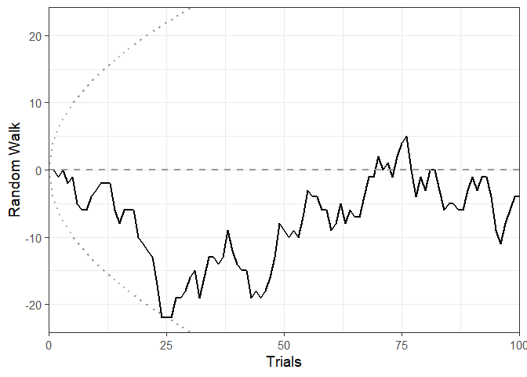<!-- -->

## Sequential Bayesian Analysis of t-tests
### Calculate Sequential Bayes Factors


``` r
# Undirectional one-sample t-tests with broad prior
bf.exp <- bfttest(exp, mu = 10, alternative = "two.sided", prior.loc = 0, prior.r = 0.707)
```

```
## One-sample t-test (N = 100)
```

```
## Calculating Sequential Bayes Factors...
```

```
## 
  |                                                                            
  |                                                                      |   0%
  |                                                                            
  |=                                                                     |   1%
  |                                                                            
  |=                                                                     |   2%
  |                                                                            
  |==                                                                    |   3%
  |                                                                            
  |===                                                                   |   4%
  |                                                                            
  |====                                                                  |   5%
  |                                                                            
  |====                                                                  |   6%
  |                                                                            
  |=====                                                                 |   7%
  |                                                                            
  |======                                                                |   8%
  |                                                                            
  |======                                                                |   9%
  |                                                                            
  |=======                                                               |  10%
  |                                                                            
  |========                                                              |  11%
  |                                                                            
  |========                                                              |  12%
  |                                                                            
  |=========                                                             |  13%
  |                                                                            
  |==========                                                            |  14%
  |                                                                            
  |===========                                                           |  15%
  |                                                                            
  |===========                                                           |  16%
  |                                                                            
  |============                                                          |  17%
  |                                                                            
  |=============                                                         |  18%
  |                                                                            
  |=============                                                         |  19%
  |                                                                            
  |==============                                                        |  20%
  |                                                                            
  |===============                                                       |  21%
  |                                                                            
  |================                                                      |  22%
  |                                                                            
  |================                                                      |  23%
  |                                                                            
  |=================                                                     |  24%
  |                                                                            
  |==================                                                    |  25%
  |                                                                            
  |==================                                                    |  26%
  |                                                                            
  |===================                                                   |  27%
  |                                                                            
  |====================                                                  |  28%
  |                                                                            
  |=====================                                                 |  29%
  |                                                                            
  |=====================                                                 |  30%
  |                                                                            
  |======================                                                |  31%
  |                                                                            
  |=======================                                               |  32%
  |                                                                            
  |=======================                                               |  33%
  |                                                                            
  |========================                                              |  34%
  |                                                                            
  |=========================                                             |  35%
  |                                                                            
  |=========================                                             |  36%
  |                                                                            
  |==========================                                            |  37%
  |                                                                            
  |===========================                                           |  38%
  |                                                                            
  |============================                                          |  39%
  |                                                                            
  |============================                                          |  40%
  |                                                                            
  |=============================                                         |  41%
  |                                                                            
  |==============================                                        |  42%
  |                                                                            
  |==============================                                        |  43%
  |                                                                            
  |===============================                                       |  44%
  |                                                                            
  |================================                                      |  45%
  |                                                                            
  |=================================                                     |  46%
  |                                                                            
  |=================================                                     |  47%
  |                                                                            
  |==================================                                    |  48%
  |                                                                            
  |===================================                                   |  49%
  |                                                                            
  |===================================                                   |  51%
  |                                                                            
  |====================================                                  |  52%
  |                                                                            
  |=====================================                                 |  53%
  |                                                                            
  |=====================================                                 |  54%
  |                                                                            
  |======================================                                |  55%
  |                                                                            
  |=======================================                               |  56%
  |                                                                            
  |========================================                              |  57%
  |                                                                            
  |========================================                              |  58%
  |                                                                            
  |=========================================                             |  59%
  |                                                                            
  |==========================================                            |  60%
  |                                                                            
  |==========================================                            |  61%
  |                                                                            
  |===========================================                           |  62%
  |                                                                            
  |============================================                          |  63%
  |                                                                            
  |=============================================                         |  64%
  |                                                                            
  |=============================================                         |  65%
  |                                                                            
  |==============================================                        |  66%
  |                                                                            
  |===============================================                       |  67%
  |                                                                            
  |===============================================                       |  68%
  |                                                                            
  |================================================                      |  69%
  |                                                                            
  |=================================================                     |  70%
  |                                                                            
  |=================================================                     |  71%
  |                                                                            
  |==================================================                    |  72%
  |                                                                            
  |===================================================                   |  73%
  |                                                                            
  |====================================================                  |  74%
  |                                                                            
  |====================================================                  |  75%
  |                                                                            
  |=====================================================                 |  76%
  |                                                                            
  |======================================================                |  77%
  |                                                                            
  |======================================================                |  78%
  |                                                                            
  |=======================================================               |  79%
  |                                                                            
  |========================================================              |  80%
  |                                                                            
  |=========================================================             |  81%
  |                                                                            
  |=========================================================             |  82%
  |                                                                            
  |==========================================================            |  83%
  |                                                                            
  |===========================================================           |  84%
  |                                                                            
  |===========================================================           |  85%
  |                                                                            
  |============================================================          |  86%
  |                                                                            
  |=============================================================         |  87%
  |                                                                            
  |==============================================================        |  88%
  |                                                                            
  |==============================================================        |  89%
  |                                                                            
  |===============================================================       |  90%
  |                                                                            
  |================================================================      |  91%
  |                                                                            
  |================================================================      |  92%
  |                                                                            
  |=================================================================     |  93%
  |                                                                            
  |==================================================================    |  94%
  |                                                                            
  |==================================================================    |  95%
  |                                                                            
  |===================================================================   |  96%
  |                                                                            
  |====================================================================  |  97%
  |                                                                            
  |===================================================================== |  98%
  |                                                                            
  |===================================================================== |  99%
  |                                                                            
  |======================================================================| 100%
```

```
## Final Bayes Factor: BF10 = 2.640 (t-value = 2.595; p = 0.011; δ = 0.259)
```

``` r
print(bf.exp)
```

```
## 
##   Sequential Bayesian Testing
##   --------------------------------
##   Test: One-sample t-test (parametric)
##   Sample size: 100
##   Final Bayes Factor: BF10 = 2.640; BF01 = 0.379
##   Prior: Cauchy(0.000, 0.707)
##   Alternative hypothesis: two.sided
##   t-value: 2.595; p = 0.011
##   Effect size: δ ≈ 0.259 (approximation from t-statistic)
## 
```

``` r
# Use exact=FALSE for a quicker test that doers not calculate every single BF
bf.con <- bfttest(con, mu = 10, alternative = "two.sided", prior.loc = 0, prior.r = 0.707, exact=FALSE)
```

```
## One-sample t-test (N = 100)
## Calculating Sequential Bayes Factors...
```

```
## 
  |                                                                            
  |                                                                      |   0%
  |                                                                            
  |=                                                                     |   1%
  |                                                                            
  |=                                                                     |   2%
  |                                                                            
  |==                                                                    |   3%
  |                                                                            
  |===                                                                   |   4%
  |                                                                            
  |====                                                                  |   5%
  |                                                                            
  |====                                                                  |   6%
  |                                                                            
  |=====                                                                 |   7%
  |                                                                            
  |======                                                                |   8%
  |                                                                            
  |======                                                                |   9%
  |                                                                            
  |=======                                                               |  10%
  |                                                                            
  |========                                                              |  11%
  |                                                                            
  |========                                                              |  12%
  |                                                                            
  |=========                                                             |  13%
  |                                                                            
  |==========                                                            |  14%
  |                                                                            
  |===========                                                           |  15%
  |                                                                            
  |===========                                                           |  16%
  |                                                                            
  |============                                                          |  17%
  |                                                                            
  |=============                                                         |  18%
  |                                                                            
  |=============                                                         |  19%
  |                                                                            
  |==============                                                        |  20%
  |                                                                            
  |===============                                                       |  21%
  |                                                                            
  |================                                                      |  22%
  |                                                                            
  |================                                                      |  23%
  |                                                                            
  |=================                                                     |  24%
  |                                                                            
  |==================                                                    |  25%
  |                                                                            
  |==================                                                    |  26%
  |                                                                            
  |===================                                                   |  27%
  |                                                                            
  |====================                                                  |  28%
  |                                                                            
  |=====================                                                 |  29%
  |                                                                            
  |=====================                                                 |  30%
  |                                                                            
  |======================                                                |  31%
  |                                                                            
  |=======================                                               |  32%
  |                                                                            
  |=======================                                               |  33%
  |                                                                            
  |========================                                              |  34%
  |                                                                            
  |=========================                                             |  35%
  |                                                                            
  |=========================                                             |  36%
  |                                                                            
  |==========================                                            |  37%
  |                                                                            
  |===========================                                           |  38%
  |                                                                            
  |============================                                          |  39%
  |                                                                            
  |============================                                          |  40%
  |                                                                            
  |=============================                                         |  41%
  |                                                                            
  |==============================                                        |  42%
  |                                                                            
  |==============================                                        |  43%
  |                                                                            
  |===============================                                       |  44%
  |                                                                            
  |================================                                      |  45%
  |                                                                            
  |=================================                                     |  46%
  |                                                                            
  |=================================                                     |  47%
  |                                                                            
  |==================================                                    |  48%
  |                                                                            
  |===================================                                   |  49%
  |                                                                            
  |===================================                                   |  51%
  |                                                                            
  |====================================                                  |  52%
  |                                                                            
  |=====================================                                 |  53%
  |                                                                            
  |=====================================                                 |  54%
  |                                                                            
  |======================================                                |  55%
  |                                                                            
  |=======================================                               |  56%
  |                                                                            
  |========================================                              |  57%
  |                                                                            
  |========================================                              |  58%
  |                                                                            
  |=========================================                             |  59%
  |                                                                            
  |==========================================                            |  60%
  |                                                                            
  |==========================================                            |  61%
  |                                                                            
  |===========================================                           |  62%
  |                                                                            
  |============================================                          |  63%
  |                                                                            
  |=============================================                         |  64%
  |                                                                            
  |=============================================                         |  65%
  |                                                                            
  |==============================================                        |  66%
  |                                                                            
  |===============================================                       |  67%
  |                                                                            
  |===============================================                       |  68%
  |                                                                            
  |================================================                      |  69%
  |                                                                            
  |=================================================                     |  70%
  |                                                                            
  |=================================================                     |  71%
  |                                                                            
  |==================================================                    |  72%
  |                                                                            
  |===================================================                   |  73%
  |                                                                            
  |====================================================                  |  74%
  |                                                                            
  |====================================================                  |  75%
  |                                                                            
  |=====================================================                 |  76%
  |                                                                            
  |======================================================                |  77%
  |                                                                            
  |======================================================                |  78%
  |                                                                            
  |=======================================================               |  79%
  |                                                                            
  |========================================================              |  80%
  |                                                                            
  |=========================================================             |  81%
  |                                                                            
  |=========================================================             |  82%
  |                                                                            
  |==========================================================            |  83%
  |                                                                            
  |===========================================================           |  84%
  |                                                                            
  |===========================================================           |  85%
  |                                                                            
  |============================================================          |  86%
  |                                                                            
  |=============================================================         |  87%
  |                                                                            
  |==============================================================        |  88%
  |                                                                            
  |==============================================================        |  89%
  |                                                                            
  |===============================================================       |  90%
  |                                                                            
  |================================================================      |  91%
  |                                                                            
  |================================================================      |  92%
  |                                                                            
  |=================================================================     |  93%
  |                                                                            
  |==================================================================    |  94%
  |                                                                            
  |==================================================================    |  95%
  |                                                                            
  |===================================================================   |  96%
  |                                                                            
  |====================================================================  |  97%
  |                                                                            
  |===================================================================== |  98%
  |                                                                            
  |===================================================================== |  99%
  |                                                                            
  |======================================================================| 100%
```

```
## Final Bayes Factor: BF10 = 0.112; BF01 = 8.901 (t-value = -0.173; p = 0.863; δ = -0.017)
```

``` r
print(bf.con)
```

```
## 
##   Sequential Bayesian Testing
##   --------------------------------
##   Test: One-sample t-test (parametric)
##   Sample size: 100
##   Final Bayes Factor: BF10 = 0.112; BF01 = 8.901
##   Prior: Cauchy(0.000, 0.707)
##   Alternative hypothesis: two.sided
##   t-value: -0.173; p = 0.863
##   Effect size: δ ≈ -0.017 (approximation from t-statistic)
## 
```

``` r
# only the last 5 data points
bfttest(con, mu = 10, alternative = "two.sided", prior.loc = 0, prior.r = 0.707, nstart = length(con)-5)
```

```
## One-sample t-test (N = 100)
## Calculating Sequential Bayes Factors...
```

```
## 
  |                                                                            
  |                                                                      |   0%
  |                                                                            
  |============                                                          |  17%
  |                                                                            
  |=======================                                               |  33%
  |                                                                            
  |===================================                                   |  50%
  |                                                                            
  |===============================================                       |  67%
  |                                                                            
  |==========================================================            |  83%
  |                                                                            
  |======================================================================| 100%
```

```
## Final Bayes Factor: BF10 = 0.112; BF01 = 8.901 (t-value = -0.173; p = 0.863; δ = -0.017)
```

```
## 
##   Sequential Bayesian Testing
##   --------------------------------
##   Test: One-sample t-test (parametric)
##   Sample size: 100
##   Final Bayes Factor: BF10 = 0.112; BF01 = 8.901
##   Prior: Cauchy(0.000, 0.707)
##   Alternative hypothesis: two.sided
##   t-value: -0.173; p = 0.863
##   Effect size: δ ≈ -0.017 (approximation from t-statistic)
## 
```

``` r
# Directional paired samples t-test with narrow prior
bf.paired <- bfttest(exp, con, alternative = "greater", prior.loc = 0, prior.r = 0.1)
```

```
## Paired t-test (N = 100)
## Calculating Sequential Bayes Factors...
```

```
## 
  |                                                                            
  |                                                                      |   0%
  |                                                                            
  |=                                                                     |   1%
  |                                                                            
  |=                                                                     |   2%
  |                                                                            
  |==                                                                    |   3%
  |                                                                            
  |===                                                                   |   4%
  |                                                                            
  |====                                                                  |   5%
  |                                                                            
  |====                                                                  |   6%
  |                                                                            
  |=====                                                                 |   7%
  |                                                                            
  |======                                                                |   8%
  |                                                                            
  |======                                                                |   9%
  |                                                                            
  |=======                                                               |  10%
  |                                                                            
  |========                                                              |  11%
  |                                                                            
  |========                                                              |  12%
  |                                                                            
  |=========                                                             |  13%
  |                                                                            
  |==========                                                            |  14%
  |                                                                            
  |===========                                                           |  15%
  |                                                                            
  |===========                                                           |  16%
  |                                                                            
  |============                                                          |  17%
  |                                                                            
  |=============                                                         |  18%
  |                                                                            
  |=============                                                         |  19%
  |                                                                            
  |==============                                                        |  20%
  |                                                                            
  |===============                                                       |  21%
  |                                                                            
  |================                                                      |  22%
  |                                                                            
  |================                                                      |  23%
  |                                                                            
  |=================                                                     |  24%
  |                                                                            
  |==================                                                    |  25%
  |                                                                            
  |==================                                                    |  26%
  |                                                                            
  |===================                                                   |  27%
  |                                                                            
  |====================                                                  |  28%
  |                                                                            
  |=====================                                                 |  29%
  |                                                                            
  |=====================                                                 |  30%
  |                                                                            
  |======================                                                |  31%
  |                                                                            
  |=======================                                               |  32%
  |                                                                            
  |=======================                                               |  33%
  |                                                                            
  |========================                                              |  34%
  |                                                                            
  |=========================                                             |  35%
  |                                                                            
  |=========================                                             |  36%
  |                                                                            
  |==========================                                            |  37%
  |                                                                            
  |===========================                                           |  38%
  |                                                                            
  |============================                                          |  39%
  |                                                                            
  |============================                                          |  40%
  |                                                                            
  |=============================                                         |  41%
  |                                                                            
  |==============================                                        |  42%
  |                                                                            
  |==============================                                        |  43%
  |                                                                            
  |===============================                                       |  44%
  |                                                                            
  |================================                                      |  45%
  |                                                                            
  |=================================                                     |  46%
  |                                                                            
  |=================================                                     |  47%
  |                                                                            
  |==================================                                    |  48%
  |                                                                            
  |===================================                                   |  49%
  |                                                                            
  |===================================                                   |  51%
  |                                                                            
  |====================================                                  |  52%
  |                                                                            
  |=====================================                                 |  53%
  |                                                                            
  |=====================================                                 |  54%
  |                                                                            
  |======================================                                |  55%
  |                                                                            
  |=======================================                               |  56%
  |                                                                            
  |========================================                              |  57%
  |                                                                            
  |========================================                              |  58%
  |                                                                            
  |=========================================                             |  59%
  |                                                                            
  |==========================================                            |  60%
  |                                                                            
  |==========================================                            |  61%
  |                                                                            
  |===========================================                           |  62%
  |                                                                            
  |============================================                          |  63%
  |                                                                            
  |=============================================                         |  64%
  |                                                                            
  |=============================================                         |  65%
  |                                                                            
  |==============================================                        |  66%
  |                                                                            
  |===============================================                       |  67%
  |                                                                            
  |===============================================                       |  68%
  |                                                                            
  |================================================                      |  69%
  |                                                                            
  |=================================================                     |  70%
  |                                                                            
  |=================================================                     |  71%
  |                                                                            
  |==================================================                    |  72%
  |                                                                            
  |===================================================                   |  73%
  |                                                                            
  |====================================================                  |  74%
  |                                                                            
  |====================================================                  |  75%
  |                                                                            
  |=====================================================                 |  76%
  |                                                                            
  |======================================================                |  77%
  |                                                                            
  |======================================================                |  78%
  |                                                                            
  |=======================================================               |  79%
  |                                                                            
  |========================================================              |  80%
  |                                                                            
  |=========================================================             |  81%
  |                                                                            
  |=========================================================             |  82%
  |                                                                            
  |==========================================================            |  83%
  |                                                                            
  |===========================================================           |  84%
  |                                                                            
  |===========================================================           |  85%
  |                                                                            
  |============================================================          |  86%
  |                                                                            
  |=============================================================         |  87%
  |                                                                            
  |==============================================================        |  88%
  |                                                                            
  |==============================================================        |  89%
  |                                                                            
  |===============================================================       |  90%
  |                                                                            
  |================================================================      |  91%
  |                                                                            
  |================================================================      |  92%
  |                                                                            
  |=================================================================     |  93%
  |                                                                            
  |==================================================================    |  94%
  |                                                                            
  |==================================================================    |  95%
  |                                                                            
  |===================================================================   |  96%
  |                                                                            
  |====================================================================  |  97%
  |                                                                            
  |===================================================================== |  98%
  |                                                                            
  |===================================================================== |  99%
  |                                                                            
  |======================================================================| 100%
```

```
## Final Bayes Factor: BF10 = 2.960 (t-value = 1.974; p = 0.026; δ = 0.197)
```

``` r
print(bf.paired)
```

```
## 
##   Sequential Bayesian Testing
##   --------------------------------
##   Test: Paired t-test (parametric)
##   Sample size: 100
##   Final Bayes Factor: BF10 = 2.960; BF01 = 0.338
##   Prior: Cauchy(0.000, 0.100)
##   Alternative hypothesis: greater
##   t-value: 1.974; p = 0.026
##   Effect size: δ ≈ 0.197 (approximation from t-statistic)
## 
```

``` r
# Independent samples t-test with informed prior
bf.between <- bfttest(value ~ condition, data = df, alternative = "less", prior.loc = 0.1, prior.r = 0.1)
```

```
## Independent t-test (N = 200 [100 + 100])
## Calculating Sequential Bayes Factors...
```

```
## 
  |                                                                            
  |                                                                      |   0%
  |                                                                            
  |=                                                                     |   1%
  |                                                                            
  |=                                                                     |   2%
  |                                                                            
  |==                                                                    |   3%
  |                                                                            
  |===                                                                   |   4%
  |                                                                            
  |====                                                                  |   5%
  |                                                                            
  |====                                                                  |   6%
  |                                                                            
  |=====                                                                 |   7%
  |                                                                            
  |======                                                                |   8%
  |                                                                            
  |======                                                                |   9%
  |                                                                            
  |=======                                                               |  10%
  |                                                                            
  |========                                                              |  11%
  |                                                                            
  |========                                                              |  12%
  |                                                                            
  |=========                                                             |  13%
  |                                                                            
  |==========                                                            |  14%
  |                                                                            
  |==========                                                            |  15%
  |                                                                            
  |===========                                                           |  16%
  |                                                                            
  |============                                                          |  17%
  |                                                                            
  |=============                                                         |  18%
  |                                                                            
  |=============                                                         |  19%
  |                                                                            
  |==============                                                        |  20%
  |                                                                            
  |===============                                                       |  21%
  |                                                                            
  |===============                                                       |  22%
  |                                                                            
  |================                                                      |  23%
  |                                                                            
  |=================                                                     |  24%
  |                                                                            
  |==================                                                    |  25%
  |                                                                            
  |==================                                                    |  26%
  |                                                                            
  |===================                                                   |  27%
  |                                                                            
  |====================                                                  |  28%
  |                                                                            
  |====================                                                  |  29%
  |                                                                            
  |=====================                                                 |  30%
  |                                                                            
  |======================                                                |  31%
  |                                                                            
  |======================                                                |  32%
  |                                                                            
  |=======================                                               |  33%
  |                                                                            
  |========================                                              |  34%
  |                                                                            
  |========================                                              |  35%
  |                                                                            
  |=========================                                             |  36%
  |                                                                            
  |==========================                                            |  37%
  |                                                                            
  |===========================                                           |  38%
  |                                                                            
  |===========================                                           |  39%
  |                                                                            
  |============================                                          |  40%
  |                                                                            
  |=============================                                         |  41%
  |                                                                            
  |=============================                                         |  42%
  |                                                                            
  |==============================                                        |  43%
  |                                                                            
  |===============================                                       |  44%
  |                                                                            
  |================================                                      |  45%
  |                                                                            
  |================================                                      |  46%
  |                                                                            
  |=================================                                     |  47%
  |                                                                            
  |==================================                                    |  48%
  |                                                                            
  |==================================                                    |  49%
  |                                                                            
  |===================================                                   |  50%
  |                                                                            
  |====================================                                  |  51%
  |                                                                            
  |====================================                                  |  52%
  |                                                                            
  |=====================================                                 |  53%
  |                                                                            
  |======================================                                |  54%
  |                                                                            
  |======================================                                |  55%
  |                                                                            
  |=======================================                               |  56%
  |                                                                            
  |========================================                              |  57%
  |                                                                            
  |=========================================                             |  58%
  |                                                                            
  |=========================================                             |  59%
  |                                                                            
  |==========================================                            |  60%
  |                                                                            
  |===========================================                           |  61%
  |                                                                            
  |===========================================                           |  62%
  |                                                                            
  |============================================                          |  63%
  |                                                                            
  |=============================================                         |  64%
  |                                                                            
  |==============================================                        |  65%
  |                                                                            
  |==============================================                        |  66%
  |                                                                            
  |===============================================                       |  67%
  |                                                                            
  |================================================                      |  68%
  |                                                                            
  |================================================                      |  69%
  |                                                                            
  |=================================================                     |  70%
  |                                                                            
  |==================================================                    |  71%
  |                                                                            
  |==================================================                    |  72%
  |                                                                            
  |===================================================                   |  73%
  |                                                                            
  |====================================================                  |  74%
  |                                                                            
  |====================================================                  |  75%
  |                                                                            
  |=====================================================                 |  76%
  |                                                                            
  |======================================================                |  77%
  |                                                                            
  |=======================================================               |  78%
  |                                                                            
  |=======================================================               |  79%
  |                                                                            
  |========================================================              |  80%
  |                                                                            
  |=========================================================             |  81%
  |                                                                            
  |=========================================================             |  82%
  |                                                                            
  |==========================================================            |  83%
  |                                                                            
  |===========================================================           |  84%
  |                                                                            
  |============================================================          |  85%
  |                                                                            
  |============================================================          |  86%
  |                                                                            
  |=============================================================         |  87%
  |                                                                            
  |==============================================================        |  88%
  |                                                                            
  |==============================================================        |  89%
  |                                                                            
  |===============================================================       |  90%
  |                                                                            
  |================================================================      |  91%
  |                                                                            
  |================================================================      |  92%
  |                                                                            
  |=================================================================     |  93%
  |                                                                            
  |==================================================================    |  94%
  |                                                                            
  |==================================================================    |  95%
  |                                                                            
  |===================================================================   |  96%
  |                                                                            
  |====================================================================  |  97%
  |                                                                            
  |===================================================================== |  98%
  |                                                                            
  |===================================================================== |  99%
  |                                                                            
  |======================================================================| 100%
```

```
## Final Bayes Factor: BF10 = 2.362 (t-value = -1.866; p = 0.032; δ = -0.264)
```

``` r
print(bf.between)
```

```
## 
##   Sequential Bayesian Testing
##   --------------------------------
##   Test: Independent t-test (parametric)
##   Sample size: 100, 100
##   Final Bayes Factor: BF10 = 2.362; BF01 = 0.423
##   Prior: Cauchy(0.100, 0.100)
##   Alternative hypothesis: less
##   t-value: -1.866; p = 0.032
##   Effect size: δ ≈ -0.264 (approximation from t-statistic)
## 
```

### Non-parametric Sequential Bayes Factors

``` r
# One-sample Wilcoxon signed-rank test
bf.onesample.np <- bfttest(exp, mu = 10, alternative = "two.sided", prior.loc = 0, prior.r = 0.707, exact = FALSE, parametric = FALSE)
```

```
## One-sample Wilcoxon signed-rank test (N = 100)
```

```
## MCMC samples: 250 (intermediate) → 1000 (final)
```

```
## Calculating Sequential Bayes Factors...
```

```
## 
  |                                                                            
  |                                                                      |   0%
  |                                                                            
  |                                                                      |   1%
  |                                                                            
  |=                                                                     |   1%
  |                                                                            
  |=                                                                     |   2%
  |                                                                            
  |==                                                                    |   2%
  |                                                                            
  |==                                                                    |   3%
  |                                                                            
  |===                                                                   |   4%
  |                                                                            
  |===                                                                   |   5%
  |                                                                            
  |====                                                                  |   5%
  |                                                                            
  |====                                                                  |   6%
  |                                                                            
  |=====                                                                 |   7%
  |                                                                            
  |=====                                                                 |   8%
  |                                                                            
  |======                                                                |   8%
  |                                                                            
  |======                                                                |   9%
  |                                                                            
  |=======                                                               |  10%
  |                                                                            
  |========                                                              |  11%
  |                                                                            
  |========                                                              |  12%
  |                                                                            
  |=========                                                             |  12%
  |                                                                            
  |=========                                                             |  13%
  |                                                                            
  |==========                                                            |  14%
  |                                                                            
  |==========                                                            |  15%
  |                                                                            
  |===========                                                           |  15%
  |                                                                            
  |===========                                                           |  16%
  |                                                                            
  |============                                                          |  17%
  |                                                                            
  |=============                                                         |  18%
  |                                                                            
  |=============                                                         |  19%
  |                                                                            
  |==============                                                        |  20%
  |                                                                            
  |==============                                                        |  21%
  |                                                                            
  |===============                                                       |  22%
  |                                                                            
  |================                                                      |  23%
  |                                                                            
  |=================                                                     |  24%
  |                                                                            
  |=================                                                     |  25%
  |                                                                            
  |==================                                                    |  26%
  |                                                                            
  |===================                                                   |  27%
  |                                                                            
  |===================                                                   |  28%
  |                                                                            
  |====================                                                  |  29%
  |                                                                            
  |=====================                                                 |  30%
  |                                                                            
  |======================                                                |  31%
  |                                                                            
  |======================                                                |  32%
  |                                                                            
  |=======================                                               |  33%
  |                                                                            
  |========================                                              |  34%
  |                                                                            
  |=========================                                             |  36%
  |                                                                            
  |==========================                                            |  37%
  |                                                                            
  |===========================                                           |  38%
  |                                                                            
  |============================                                          |  39%
  |                                                                            
  |============================                                          |  41%
  |                                                                            
  |=============================                                         |  42%
  |                                                                            
  |==============================                                        |  43%
  |                                                                            
  |===============================                                       |  45%
  |                                                                            
  |================================                                      |  46%
  |                                                                            
  |=================================                                     |  47%
  |                                                                            
  |==================================                                    |  49%
  |                                                                            
  |===================================                                   |  50%
  |                                                                            
  |====================================                                  |  52%
  |                                                                            
  |=====================================                                 |  53%
  |                                                                            
  |======================================                                |  55%
  |                                                                            
  |=======================================                               |  56%
  |                                                                            
  |========================================                              |  58%
  |                                                                            
  |=========================================                             |  59%
  |                                                                            
  |==========================================                            |  61%
  |                                                                            
  |============================================                          |  62%
  |                                                                            
  |=============================================                         |  64%
  |                                                                            
  |==============================================                        |  65%
  |                                                                            
  |===============================================                       |  67%
  |                                                                            
  |================================================                      |  69%
  |                                                                            
  |=================================================                     |  70%
  |                                                                            
  |==================================================                    |  72%
  |                                                                            
  |====================================================                  |  74%
  |                                                                            
  |=====================================================                 |  76%
  |                                                                            
  |======================================================                |  77%
  |                                                                            
  |=======================================================               |  79%
  |                                                                            
  |=========================================================             |  81%
  |                                                                            
  |==========================================================            |  83%
  |                                                                            
  |===========================================================           |  85%
  |                                                                            
  |=============================================================         |  86%
  |                                                                            
  |==============================================================        |  88%
  |                                                                            
  |===============================================================       |  90%
  |                                                                            
  |================================================================      |  92%
  |                                                                            
  |==================================================================    |  94%
  |                                                                            
  |===================================================================   |  96%
  |                                                                            
  |===================================================================== |  98%
  |                                                                            
  |======================================================================| 100%
```

```
## Final Bayes Factor: BF10 = 2.903 (W-value = 2347.500; p = 0.011; δ = 0.262)
```

``` r
print(bf.onesample.np)
```

```
## 
##   Sequential Bayesian Testing
##   --------------------------------
##   Test: One-sample Wilcoxon signed-rank test (non-parametric)
##   Sample size: 100
##   Final Bayes Factor: BF10 = 2.903; BF01 = 0.344
##   Prior: Cauchy(0.000, 0.707)
##   Alternative hypothesis: two.sided
##   W-value: 2347.500; p = 0.011
##   Effect size: δ = 0.262, 95% CI [0.055, 0.467]
## 
```

``` r
# Paired Wilcoxon signed-rank test
bf.paired.np <- bfttest(exp, con, alternative = "greater", prior.loc = 0, prior.r = 0.1, exact = FALSE, parametric = FALSE)
```

```
## Paired Wilcoxon signed-rank test (N = 100)
```

```
## MCMC samples: 250 (intermediate) → 1000 (final)
```

```
## Calculating Sequential Bayes Factors...
```

```
## 
  |                                                                            
  |                                                                      |   0%
  |                                                                            
  |                                                                      |   1%
  |                                                                            
  |=                                                                     |   1%
  |                                                                            
  |=                                                                     |   2%
  |                                                                            
  |==                                                                    |   2%
  |                                                                            
  |==                                                                    |   3%
  |                                                                            
  |===                                                                   |   4%
  |                                                                            
  |===                                                                   |   5%
  |                                                                            
  |====                                                                  |   5%
  |                                                                            
  |====                                                                  |   6%
  |                                                                            
  |=====                                                                 |   7%
  |                                                                            
  |=====                                                                 |   8%
  |                                                                            
  |======                                                                |   8%
  |                                                                            
  |======                                                                |   9%
  |                                                                            
  |=======                                                               |  10%
  |                                                                            
  |========                                                              |  11%
  |                                                                            
  |========                                                              |  12%
  |                                                                            
  |=========                                                             |  12%
  |                                                                            
  |=========                                                             |  13%
  |                                                                            
  |==========                                                            |  14%
  |                                                                            
  |==========                                                            |  15%
  |                                                                            
  |===========                                                           |  15%
  |                                                                            
  |===========                                                           |  16%
  |                                                                            
  |============                                                          |  17%
  |                                                                            
  |=============                                                         |  18%
  |                                                                            
  |=============                                                         |  19%
  |                                                                            
  |==============                                                        |  20%
  |                                                                            
  |==============                                                        |  21%
  |                                                                            
  |===============                                                       |  22%
  |                                                                            
  |================                                                      |  23%
  |                                                                            
  |=================                                                     |  24%
  |                                                                            
  |=================                                                     |  25%
  |                                                                            
  |==================                                                    |  26%
  |                                                                            
  |===================                                                   |  27%
  |                                                                            
  |===================                                                   |  28%
  |                                                                            
  |====================                                                  |  29%
  |                                                                            
  |=====================                                                 |  30%
  |                                                                            
  |======================                                                |  31%
  |                                                                            
  |======================                                                |  32%
  |                                                                            
  |=======================                                               |  33%
  |                                                                            
  |========================                                              |  34%
  |                                                                            
  |=========================                                             |  36%
  |                                                                            
  |==========================                                            |  37%
  |                                                                            
  |===========================                                           |  38%
  |                                                                            
  |============================                                          |  39%
  |                                                                            
  |============================                                          |  41%
  |                                                                            
  |=============================                                         |  42%
  |                                                                            
  |==============================                                        |  43%
  |                                                                            
  |===============================                                       |  45%
  |                                                                            
  |================================                                      |  46%
  |                                                                            
  |=================================                                     |  47%
  |                                                                            
  |==================================                                    |  49%
  |                                                                            
  |===================================                                   |  50%
  |                                                                            
  |====================================                                  |  52%
  |                                                                            
  |=====================================                                 |  53%
  |                                                                            
  |======================================                                |  55%
  |                                                                            
  |=======================================                               |  56%
  |                                                                            
  |========================================                              |  58%
  |                                                                            
  |=========================================                             |  59%
  |                                                                            
  |==========================================                            |  61%
  |                                                                            
  |============================================                          |  62%
  |                                                                            
  |=============================================                         |  64%
  |                                                                            
  |==============================================                        |  65%
  |                                                                            
  |===============================================                       |  67%
  |                                                                            
  |================================================                      |  69%
  |                                                                            
  |=================================================                     |  70%
  |                                                                            
  |==================================================                    |  72%
  |                                                                            
  |====================================================                  |  74%
  |                                                                            
  |=====================================================                 |  76%
  |                                                                            
  |======================================================                |  77%
  |                                                                            
  |=======================================================               |  79%
  |                                                                            
  |=========================================================             |  81%
  |                                                                            
  |==========================================================            |  83%
  |                                                                            
  |===========================================================           |  85%
  |                                                                            
  |=============================================================         |  86%
  |                                                                            
  |==============================================================        |  88%
  |                                                                            
  |===============================================================       |  90%
  |                                                                            
  |================================================================      |  92%
  |                                                                            
  |==================================================================    |  94%
  |                                                                            
  |===================================================================   |  96%
  |                                                                            
  |===================================================================== |  98%
  |                                                                            
  |======================================================================| 100%
```

```
## Final Bayes Factor: BF10 = 3.096 (W-value = 2532.500; p = 0.025; δ = 0.122)
```

``` r
print(bf.paired.np)
```

```
## 
##   Sequential Bayesian Testing
##   --------------------------------
##   Test: Paired Wilcoxon signed-rank test (non-parametric)
##   Sample size: 100
##   Final Bayes Factor: BF10 = 3.096; BF01 = 0.323
##   Prior: Cauchy(0.000, 0.100)
##   Alternative hypothesis: greater
##   W-value: 2532.500; p = 0.025
##   Effect size: δ = 0.122, 95% CI [-0.034, 0.328]
## 
```

``` r
# Mann-Whitney U test
bf.between.np <- bfttest(value ~ condition, data = df, alternative = "less", prior.loc = 0.1, prior.r = 0.1, exact = FALSE, parametric = FALSE)
```

```
## Mann-Whitney U test (N = 200 [100 + 100])
```

```
## MCMC samples: 250 (intermediate) → 1000 (final)
```

```
## Calculating Sequential Bayes Factors...
```

```
## 
  |                                                                            
  |                                                                      |   0%
  |                                                                            
  |=                                                                     |   1%
  |                                                                            
  |==                                                                    |   3%
  |                                                                            
  |===                                                                   |   4%
  |                                                                            
  |====                                                                  |   6%
  |                                                                            
  |=====                                                                 |   7%
  |                                                                            
  |======                                                                |   9%
  |                                                                            
  |=======                                                               |  10%
  |                                                                            
  |========                                                              |  12%
  |                                                                            
  |=========                                                             |  14%
  |                                                                            
  |===========                                                           |  15%
  |                                                                            
  |============                                                          |  17%
  |                                                                            
  |=============                                                         |  19%
  |                                                                            
  |==============                                                        |  20%
  |                                                                            
  |===============                                                       |  22%
  |                                                                            
  |=================                                                     |  24%
  |                                                                            
  |==================                                                    |  26%
  |                                                                            
  |===================                                                   |  27%
  |                                                                            
  |=====================                                                 |  29%
  |                                                                            
  |======================                                                |  31%
  |                                                                            
  |=======================                                               |  33%
  |                                                                            
  |=========================                                             |  35%
  |                                                                            
  |==========================                                            |  37%
  |                                                                            
  |===========================                                           |  39%
  |                                                                            
  |=============================                                         |  41%
  |                                                                            
  |==============================                                        |  43%
  |                                                                            
  |================================                                      |  45%
  |                                                                            
  |=================================                                     |  47%
  |                                                                            
  |===================================                                   |  49%
  |                                                                            
  |====================================                                  |  51%
  |                                                                            
  |======================================                                |  54%
  |                                                                            
  |=======================================                               |  56%
  |                                                                            
  |=========================================                             |  58%
  |                                                                            
  |==========================================                            |  60%
  |                                                                            
  |============================================                          |  63%
  |                                                                            
  |=============================================                         |  65%
  |                                                                            
  |===============================================                       |  67%
  |                                                                            
  |=================================================                     |  70%
  |                                                                            
  |==================================================                    |  72%
  |                                                                            
  |====================================================                  |  74%
  |                                                                            
  |======================================================                |  77%
  |                                                                            
  |========================================================              |  79%
  |                                                                            
  |=========================================================             |  82%
  |                                                                            
  |===========================================================           |  84%
  |                                                                            
  |=============================================================         |  87%
  |                                                                            
  |===============================================================       |  89%
  |                                                                            
  |================================================================      |  92%
  |                                                                            
  |==================================================================    |  95%
  |                                                                            
  |====================================================================  |  97%
  |                                                                            
  |======================================================================| 100%
```

```
## Final Bayes Factor: BF10 = 0.302; BF01 = 3.316 (W-value = 5686.000; p = 0.955; δ = 0.122)
```

``` r
print(bf.between.np)
```

```
## 
##   Sequential Bayesian Testing
##   --------------------------------
##   Test: Mann-Whitney U test (non-parametric)
##   Sample size: 100, 100
##   Final Bayes Factor: BF10 = 0.302; BF01 = 3.316
##   Prior: Cauchy(0.100, 0.100)
##   Alternative hypothesis: less
##   W-value: 5686.000; p = 0.955
##   Effect size: δ = 0.122, 95% CI [-0.062, 0.420]
## 
```

### Plot Seq BFs


``` r
# Plot seqbf object
plot(bf.paired)
```

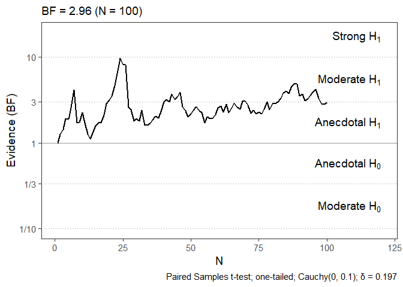<!-- -->

``` r
# Plot multiple BFs
plotbf(list(exp=bf.exp$BF, con=bf.con$BF))
```

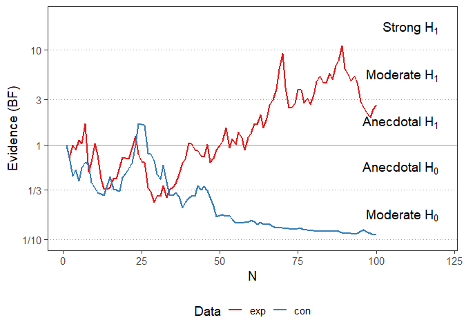<!-- -->

### Robustness analyis


``` r
bf.paired.robust <- bfRobustness(bf.paired)
```

```
## Highest BF = 5.18 with prior: Cauchy(0.2, 0.05)
```

``` r
print(bf.paired.robust)
```

```
## 
##   Prior Robustness Analysis
##   --------------------------------	
##   Test type: paired
##   Sample size: 100
##   Tested priors: 
##   -- distribution: Cauchy
##   -- location: 0,0.05,0.1,0.15,0.2,0.25,0.3,0.35,0.4,0.45,0.5,0.55,0.6,0.65,0.7,0.75,0.8,0.85,0.9,0.95,1
##   -- scale: 0.05,0.1,0.15,0.2,0.25,0.3,0.35,0.4,0.45,0.5,0.55,0.6,0.65,0.7,0.75,0.8,0.85,0.9,0.95,1
##   Highest Bayes Factor: 5.181 with prior: Cauchy(0.2, 0.05)
##   Lowest Bayes Factor: 0.045 with prior: Cauchy(1, 0.05)
##   Median Bayes Factor: 0.894 
## 
```

``` r
plot(bf.paired.robust)
```

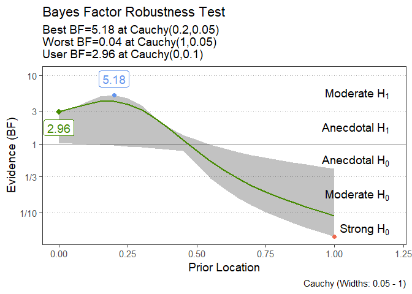<!-- -->

## Additional Sequential Tests
### Bayesian Sequential Binomial Test

``` r
data <- rbinom(100, 1, 0.6)
bf.binom <- bfbinom(data, p = 0.5, alternative = "greater")
```

```
## N = 100
```

```
## Calculating Sequential Bayes Factors...
```

```
## 
  |                                                                            
  |                                                                      |   0%
  |                                                                            
  |=                                                                     |   1%
  |                                                                            
  |=                                                                     |   2%
  |                                                                            
  |==                                                                    |   3%
  |                                                                            
  |===                                                                   |   4%
  |                                                                            
  |====                                                                  |   5%
  |                                                                            
  |====                                                                  |   6%
  |                                                                            
  |=====                                                                 |   7%
  |                                                                            
  |======                                                                |   8%
  |                                                                            
  |=======                                                               |   9%
  |                                                                            
  |=======                                                               |  11%
  |                                                                            
  |========                                                              |  12%
  |                                                                            
  |=========                                                             |  13%
  |                                                                            
  |==========                                                            |  14%
  |                                                                            
  |==========                                                            |  15%
  |                                                                            
  |===========                                                           |  16%
  |                                                                            
  |============                                                          |  17%
  |                                                                            
  |=============                                                         |  18%
  |                                                                            
  |=============                                                         |  19%
  |                                                                            
  |==============                                                        |  20%
  |                                                                            
  |===============                                                       |  21%
  |                                                                            
  |===============                                                       |  22%
  |                                                                            
  |================                                                      |  23%
  |                                                                            
  |=================                                                     |  24%
  |                                                                            
  |==================                                                    |  25%
  |                                                                            
  |==================                                                    |  26%
  |                                                                            
  |===================                                                   |  27%
  |                                                                            
  |====================                                                  |  28%
  |                                                                            
  |=====================                                                 |  29%
  |                                                                            
  |=====================                                                 |  31%
  |                                                                            
  |======================                                                |  32%
  |                                                                            
  |=======================                                               |  33%
  |                                                                            
  |========================                                              |  34%
  |                                                                            
  |========================                                              |  35%
  |                                                                            
  |=========================                                             |  36%
  |                                                                            
  |==========================                                            |  37%
  |                                                                            
  |===========================                                           |  38%
  |                                                                            
  |===========================                                           |  39%
  |                                                                            
  |============================                                          |  40%
  |                                                                            
  |=============================                                         |  41%
  |                                                                            
  |=============================                                         |  42%
  |                                                                            
  |==============================                                        |  43%
  |                                                                            
  |===============================                                       |  44%
  |                                                                            
  |================================                                      |  45%
  |                                                                            
  |================================                                      |  46%
  |                                                                            
  |=================================                                     |  47%
  |                                                                            
  |==================================                                    |  48%
  |                                                                            
  |===================================                                   |  49%
  |                                                                            
  |===================================                                   |  51%
  |                                                                            
  |====================================                                  |  52%
  |                                                                            
  |=====================================                                 |  53%
  |                                                                            
  |======================================                                |  54%
  |                                                                            
  |======================================                                |  55%
  |                                                                            
  |=======================================                               |  56%
  |                                                                            
  |========================================                              |  57%
  |                                                                            
  |=========================================                             |  58%
  |                                                                            
  |=========================================                             |  59%
  |                                                                            
  |==========================================                            |  60%
  |                                                                            
  |===========================================                           |  61%
  |                                                                            
  |===========================================                           |  62%
  |                                                                            
  |============================================                          |  63%
  |                                                                            
  |=============================================                         |  64%
  |                                                                            
  |==============================================                        |  65%
  |                                                                            
  |==============================================                        |  66%
  |                                                                            
  |===============================================                       |  67%
  |                                                                            
  |================================================                      |  68%
  |                                                                            
  |=================================================                     |  69%
  |                                                                            
  |=================================================                     |  71%
  |                                                                            
  |==================================================                    |  72%
  |                                                                            
  |===================================================                   |  73%
  |                                                                            
  |====================================================                  |  74%
  |                                                                            
  |====================================================                  |  75%
  |                                                                            
  |=====================================================                 |  76%
  |                                                                            
  |======================================================                |  77%
  |                                                                            
  |=======================================================               |  78%
  |                                                                            
  |=======================================================               |  79%
  |                                                                            
  |========================================================              |  80%
  |                                                                            
  |=========================================================             |  81%
  |                                                                            
  |=========================================================             |  82%
  |                                                                            
  |==========================================================            |  83%
  |                                                                            
  |===========================================================           |  84%
  |                                                                            
  |============================================================          |  85%
  |                                                                            
  |============================================================          |  86%
  |                                                                            
  |=============================================================         |  87%
  |                                                                            
  |==============================================================        |  88%
  |                                                                            
  |===============================================================       |  89%
  |                                                                            
  |===============================================================       |  91%
  |                                                                            
  |================================================================      |  92%
  |                                                                            
  |=================================================================     |  93%
  |                                                                            
  |==================================================================    |  94%
  |                                                                            
  |==================================================================    |  95%
  |                                                                            
  |===================================================================   |  96%
  |                                                                            
  |====================================================================  |  97%
  |                                                                            
  |===================================================================== |  98%
  |                                                                            
  |===================================================================== |  99%
  |                                                                            
  |======================================================================| 100%
```

```
## Final Bayes Factor: BF10 = 3.886 (probability of success = 0.610; p = 0.018)
```

``` r
print(bf.binom)
```

```
## 
##   Sequential Bayesian Testing
##   --------------------------------
##   Test: Binomial proportion test
##   Sample size: 100
##   Final Bayes Factor: BF10 = 3.886; BF01 = 0.257
##   Prior: Logistic(0.000, 0.100)
##   Alternative hypothesis: greater
##   Probability of success: 0.610; p = 0.018
## 
```

``` r
plot(bf.binom)
```

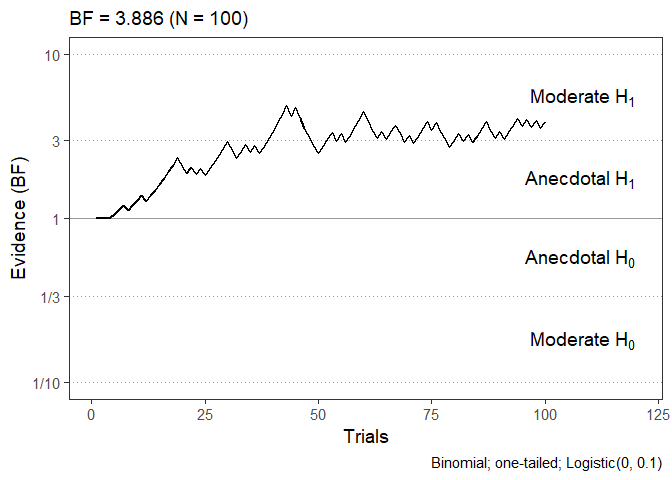<!-- -->

### Bayesian Sequential Coorelation Test

``` r
x <- rnorm(100)
y <- x + rnorm(100, 0, 5)  # Correlated data
bf.cor <- bfcor(x, y, alternative = "greater")
```

```
## N = 100
```

```
## Calculating Sequential Bayes Factors...
```

```
## 
  |                                                                            
  |                                                                      |   0%
  |                                                                            
  |=                                                                     |   1%
  |                                                                            
  |=                                                                     |   2%
  |                                                                            
  |==                                                                    |   3%
  |                                                                            
  |===                                                                   |   4%
  |                                                                            
  |====                                                                  |   5%
  |                                                                            
  |====                                                                  |   6%
  |                                                                            
  |=====                                                                 |   7%
  |                                                                            
  |======                                                                |   8%
  |                                                                            
  |=======                                                               |   9%
  |                                                                            
  |=======                                                               |  11%
  |                                                                            
  |========                                                              |  12%
  |                                                                            
  |=========                                                             |  13%
  |                                                                            
  |==========                                                            |  14%
  |                                                                            
  |==========                                                            |  15%
  |                                                                            
  |===========                                                           |  16%
  |                                                                            
  |============                                                          |  17%
  |                                                                            
  |=============                                                         |  18%
  |                                                                            
  |=============                                                         |  19%
  |                                                                            
  |==============                                                        |  20%
  |                                                                            
  |===============                                                       |  21%
  |                                                                            
  |===============                                                       |  22%
  |                                                                            
  |================                                                      |  23%
  |                                                                            
  |=================                                                     |  24%
  |                                                                            
  |==================                                                    |  25%
  |                                                                            
  |==================                                                    |  26%
  |                                                                            
  |===================                                                   |  27%
  |                                                                            
  |====================                                                  |  28%
  |                                                                            
  |=====================                                                 |  29%
  |                                                                            
  |=====================                                                 |  31%
  |                                                                            
  |======================                                                |  32%
  |                                                                            
  |=======================                                               |  33%
  |                                                                            
  |========================                                              |  34%
  |                                                                            
  |========================                                              |  35%
  |                                                                            
  |=========================                                             |  36%
  |                                                                            
  |==========================                                            |  37%
  |                                                                            
  |===========================                                           |  38%
  |                                                                            
  |===========================                                           |  39%
  |                                                                            
  |============================                                          |  40%
  |                                                                            
  |=============================                                         |  41%
  |                                                                            
  |=============================                                         |  42%
  |                                                                            
  |==============================                                        |  43%
  |                                                                            
  |===============================                                       |  44%
  |                                                                            
  |================================                                      |  45%
  |                                                                            
  |================================                                      |  46%
  |                                                                            
  |=================================                                     |  47%
  |                                                                            
  |==================================                                    |  48%
  |                                                                            
  |===================================                                   |  49%
  |                                                                            
  |===================================                                   |  51%
  |                                                                            
  |====================================                                  |  52%
  |                                                                            
  |=====================================                                 |  53%
  |                                                                            
  |======================================                                |  54%
  |                                                                            
  |======================================                                |  55%
  |                                                                            
  |=======================================                               |  56%
  |                                                                            
  |========================================                              |  57%
  |                                                                            
  |=========================================                             |  58%
  |                                                                            
  |=========================================                             |  59%
  |                                                                            
  |==========================================                            |  60%
  |                                                                            
  |===========================================                           |  61%
  |                                                                            
  |===========================================                           |  62%
  |                                                                            
  |============================================                          |  63%
  |                                                                            
  |=============================================                         |  64%
  |                                                                            
  |==============================================                        |  65%
  |                                                                            
  |==============================================                        |  66%
  |                                                                            
  |===============================================                       |  67%
  |                                                                            
  |================================================                      |  68%
  |                                                                            
  |=================================================                     |  69%
  |                                                                            
  |=================================================                     |  71%
  |                                                                            
  |==================================================                    |  72%
  |                                                                            
  |===================================================                   |  73%
  |                                                                            
  |====================================================                  |  74%
  |                                                                            
  |====================================================                  |  75%
  |                                                                            
  |=====================================================                 |  76%
  |                                                                            
  |======================================================                |  77%
  |                                                                            
  |=======================================================               |  78%
  |                                                                            
  |=======================================================               |  79%
  |                                                                            
  |========================================================              |  80%
  |                                                                            
  |=========================================================             |  81%
  |                                                                            
  |=========================================================             |  82%
  |                                                                            
  |==========================================================            |  83%
  |                                                                            
  |===========================================================           |  84%
  |                                                                            
  |============================================================          |  85%
  |                                                                            
  |============================================================          |  86%
  |                                                                            
  |=============================================================         |  87%
  |                                                                            
  |==============================================================        |  88%
  |                                                                            
  |===============================================================       |  89%
  |                                                                            
  |===============================================================       |  91%
  |                                                                            
  |================================================================      |  92%
  |                                                                            
  |=================================================================     |  93%
  |                                                                            
  |==================================================================    |  94%
  |                                                                            
  |==================================================================    |  95%
  |                                                                            
  |===================================================================   |  96%
  |                                                                            
  |====================================================================  |  97%
  |                                                                            
  |===================================================================== |  98%
  |                                                                            
  |===================================================================== |  99%
  |                                                                            
  |======================================================================| 100%
```

```
## Final Bayes Factor: BF10 = 21.326 (r = 0.278; p = 0.003)
```

``` r
print(bf.cor)
```

```
## 
##   Sequential Bayesian Testing
##   --------------------------------
##   Test: Pearson correlation test
##   Sample size: 100
##   Final Bayes Factor: BF10 = 21.326; BF01 = 0.047
##   Prior: Beta(0.000, 0.100)
##   Alternative hypothesis: greater
##   Correlation: r = 0.278; p = 0.003
## 
```

``` r
plot(bf.cor)
```

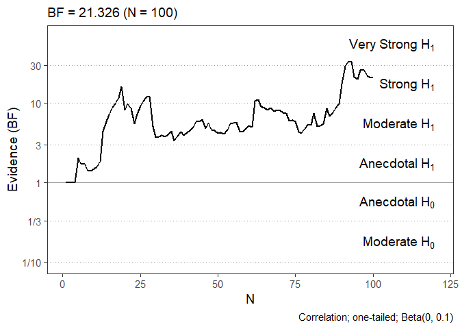<!-- -->

## Simulations
### Create simulations as empirical null distribution


``` r
# Indicate the amount of trials of one experimental run (e.g. 100 subjects * 20 trials)
# Specify the same test parameters as the test(s) you want to compare to (in this case the one-sample t-tests.)
sims <- simcreate(100*20, n.sims = 100, mean.scores = 10, use.files = F, alternative = "two.sided", prior.loc = 0, prior.r = 0.707)
```

```
## Generating 100 simulations...
```

```
## Using pseudo generation and parallel processing
```

### Plot BFs with simulation data


``` r
plot(bf.paired, sims.df = sims)
```

```
## [1] "Depending on the amount of simulations to be drawn, this might take a while!"
```

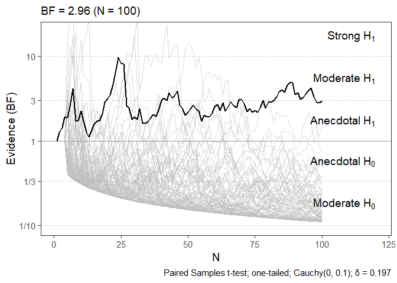<!-- -->

``` r
plotbf(list(exp=bf.exp$BF, con=bf.con$BF), sims.df = sims)
```

```
## [1] "Depending on the amount of simulations to be drawn, this might take a while!"
```

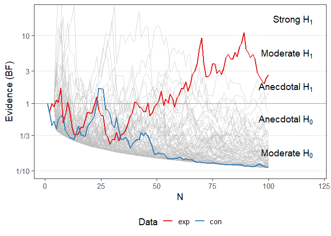<!-- -->

## Change of Evidence Measures
### Calculate All Change of Evidence (CoE) Measures

``` r
coe <- coe(bf.exp, sims)
print(coe)
```

```
## *** Change of Evidence Results ***
## 
## Number of Simulations: 100 
## -----------------------------------
## >>> MaxBF Test <<<
## 
## Max BF: 11.055 at N = 89 
## Sims with ≥ this BF: 6 %
## -----------------------------------
## >>> Energy Test <<<
## 
## Energy: 106.253 
## Simulated Energy: M = -55.53 , SD = 52.916 
## Sims with ≥ this Energy: 1 %
## -----------------------------------
## >>> FFT Test <<<
## 
## Amplitude Sum: 8.092 
## Simulated Amplitude Sum: M = 2.234 , SD = 4.248 
## Sims with ≥ this Amplitude: 6 %
## -----------------------------------
```

``` r
plot(coe)
```

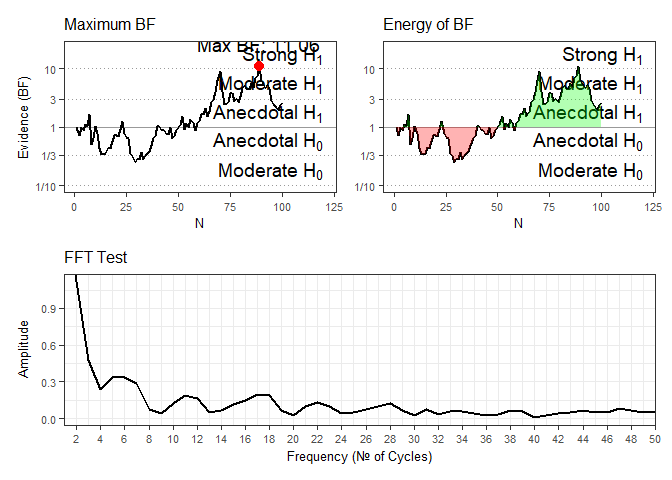<!-- -->

### Individual Change Of Evidence Measures


``` r
# Max BF
r.exp.maxbf <- maxbf(bf.exp, sims.df = sims)
r.con.maxbf <- maxbf(bf.con, sims.df = sims)

# Energy BF
r.exp.nrg <- energybf(bf.exp, sims.df = sims)
r.con.nrg <- energybf(bf.con, sims.df = sims)

# FFT Amplitude Sum
fft.exp <- fftcreate(bf.exp)
fft.con <- fftcreate(bf.con)

r.exp.fft <- ffttest(fft.exp, sims.df = sims)
r.con.fft <- ffttest(fft.con, sims.df = sims)

plotfft(fft.exp, sims.df = sims)
```

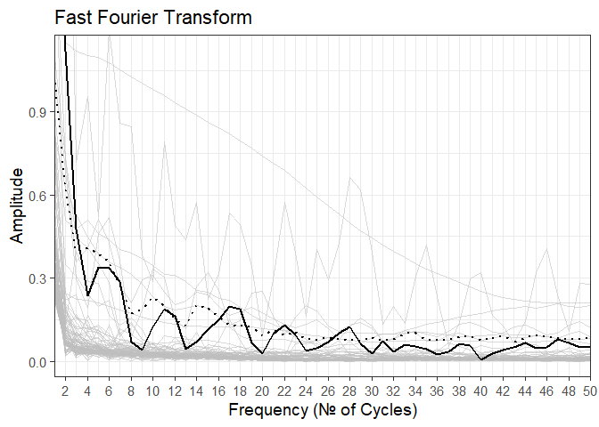<!-- -->

``` r
plotfft(fft.con, sims.df = sims)
```

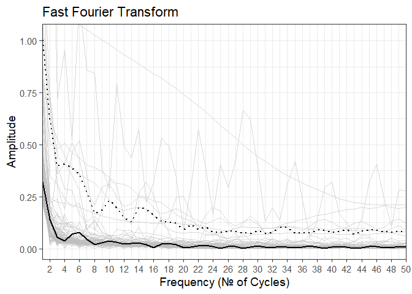<!-- -->
